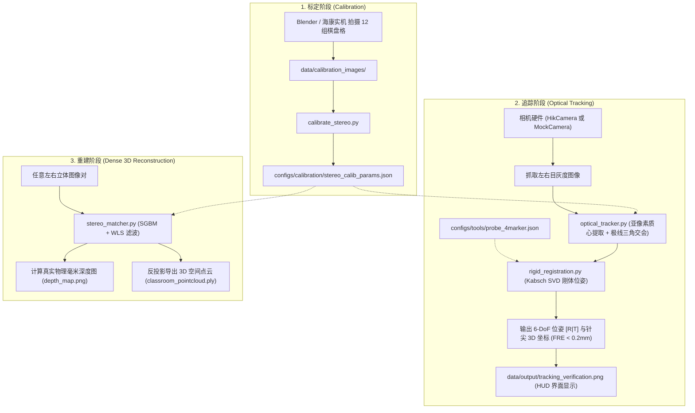

# 近红外双目视觉与手术追踪系统 —— 全工程文件注释与架构导航手册

本项目是面向**医疗外科手术导航（骨科/神经外科）**的高精度近红外（NIR）双目视觉追踪与三维重建系统。采用分层解耦架构，保证**宿舍离线仿真开发 $\longleftrightarrow$ 实验室实机硬件联调**无缝切换。

---

## 📂 根目录文件 (Root Files)

| 文件名 | 作用与注释 |
| :--- | :--- |
| [`main.py`](file:///h:/antigravity/stereo%20vision/main.py) | **系统统一总入口**。集成所有子命令：`calibrate`（标定）、`track`（器械追踪）、`reconstruct`（点云深度重建）、`test`（单元测试）。 |
| [`requirements.txt`](file:///h:/antigravity/stereo%20vision/requirements.txt) | **Python 依赖清单**。严格锁定轻量化核心库（NumPy, OpenCV-contrib, SciPy）。 |
| [`.gitignore`](file:///h:/antigravity/stereo%20vision/.gitignore) | **Git 忽略规则**。严格隔离大体积 `.blend`、大尺寸渲染图片、`.npz` 查找表与临时点云，使远程代码仓库体积保持在 1MB 以内。 |
| [`README.md`](file:///h:/antigravity/stereo%20vision/README.md) | **项目主文档**。中英文工程简介、核心特性说明与快速上手命令行指南。 |
| [`PROJECT_STRUCTURE.md`](file:///h:/antigravity/stereo%20vision/PROJECT_STRUCTURE.md) | **本项目完整文件字典与注释手册**（即本文档）。 |

---

## ⚙️ `configs/` —— 配置中心 (与代码完全解耦)

所有硬件参数、标定数值、器械 CAD 几何均以纯 JSON 形式集中管理，改动参数无需修改任何 Python 源码。

| 子路径 | 文件名 | 作用与注释 |
| :--- | :--- | :--- |
| `configs/calibration/` | [`stereo_calib_params.json`](file:///h:/antigravity/stereo%20vision/configs/calibration/stereo_calib_params.json) | **双目立体标定成果参数**。包含左/右相机内参矩阵（$K_1, K_2$）、畸变系数（$D_1, D_2$）、外参旋转与平移（$R, T$）、物理基线（60.01mm）、极线校正投影矩阵（$P_1, P_2, Q$）。 |
| `configs/cameras/` | [`hikrobot_dual_mono.json`](file:///h:/antigravity/stereo%20vision/configs/cameras/hikrobot_dual_mono.json) | **海康工业相机实机配置**。设置 Mono8 格式、5000μs 极短曝光（压制环境杂光）、增益、包大小与设备索引。 |
| `configs/cameras/` | [`mock_camera.json`](file:///h:/antigravity/stereo%20vision/configs/cameras/mock_camera.json) | **离线仿真相机配置**。设置离线读取目录、回放帧率（FPS=30）与循环回放模式。 |
| `configs/tools/` | [`probe_4marker.json`](file:///h:/antigravity/stereo%20vision/configs/tools/probe_4marker.json) | **手术探针 CAD 刚体模型定义**。定义 4 个反光标记球的局部 CAD 坐标（毫米），以及向下延伸 150mm 的针尖（Tool-Tip）物理偏置。 |

---

## 💻 `src/` —— 核心算法与源码库

### 1. `src/camera/` —— 硬件抽象层 (HAL)
实现上层视觉算法与底层硬件完全隔离，换相机无需改算法。

- [`base_camera.py`](file:///h:/antigravity/stereo%20vision/src/camera/base_camera.py)：**相机抽象基类 `BaseStereoCamera`**。定义统一的 `open()`、`grab_stereo()`、`close()` 接口与上下文管理器。
- [`mock_camera.py`](file:///h:/antigravity/stereo%20vision/src/camera/mock_camera.py)：**离线回放/仿真相机 `MockStereoCamera`**。继承基类，负责读取本地图像对（如 Blender 仿真图），模拟 30FPS 实时抓图流，供宿舍脱机调试。
- [`hik_camera.py`](file:///h:/antigravity/stereo%20vision/src/camera/hik_camera.py)：**海康工业相机实机驱动 `HikStereoCamera`**。封装海康官方 MVS SDK，开辟多线程独立同步抓取左目与右目灰度帧。
- [`__init__.py`](file:///h:/antigravity/stereo%20vision/src/camera/__init__.py)：暴露相机模块核心类。

### 2. `src/calibration/` —— 双目几何标定
- [`calibrate_stereo.py`](file:///h:/antigravity/stereo%20vision/src/calibration/calibrate_stereo.py)：**双目标定主流程**。读取标定板图片，自动执行亚像素角点精确定位（`cv2.cornerSubPix`）、单目与双目标定（`stereoCalibrate`）、Bouguet 极线校正解算，并将标定结果持久化写入 `configs/calibration/`。

### 3. `src/tracking/` —— 手术导航光学追踪 (核心技术)
- [`optical_tracker.py`](file:///h:/antigravity/stereo%20vision/src/tracking/optical_tracker.py)：**主追踪控制器 `OpticalTracker`**。
  1. 亚像素灰度重心法提取近红外反光球中心；
  2. 利用相机标定内参将斑点坐标映射到极线归一化坐标系；
  3. 双目极线立体交会（Triangulation）重构空间三维标记球；
  4. 实时在图像上绘制 HUD 状态、光斑标记与针尖红十字准星。
- [`rigid_registration.py`](file:///h:/antigravity/stereo%20vision/src/tracking/rigid_registration.py)：**Kabsch / Arun's SVD 刚体位姿估计**。
  - `register_point_sets_svd`：基于奇异值分解计算刚体最佳旋转矩阵 $R$ 与平移向量 $T$，并计算目标定位残差（FRE）；
  - `match_rigid_body_correspondence`：全自动求解视觉检测到的无序标记点与 CAD 模型点之间的排列对应关系。
- [`surgical_tool.py`](file:///h:/antigravity/stereo%20vision/src/tracking/surgical_tool.py)：**手术器械数据实体 `SurgicalTool`**。解析器械 JSON 文件，根据解算位姿动态计算器械末端（针尖）在相机坐标系下的三维坐标：$P_{tip} = R \cdot P_{offset} + T$。
- [`__init__.py`](file:///h:/antigravity/stereo%20vision/src/tracking/__init__.py)：暴露追踪模块核心接口。

### 4. `src/stereo/` —— 稠密立体匹配与三维重建
- [`stereo_matcher.py`](file:///h:/antigravity/stereo%20vision/src/stereo/stereo_matcher.py)：**稠密点云与深度图管线 `StereoVisionPipeline`**。
  1. 极线校正重映射；
  2. SGBM 视差匹配 + WLS 边缘保持滤波；
  3. 真实毫米物理深度图计算（`compute_depth_map`）；
  4. 深度伪彩图生成（`visualize_depth_map`）；
  5. 空间点云反投影与 ASCII PLY 文件导出（`disparity_to_pointcloud`, `save_ply`）。

---

## 🎨 `blender_assets/` —— 3D 资产与模型文件

| 目录/文件 | 作用与注释 |
| :--- | :--- |
| `blender_assets/tools/` | **手术器械 3D 物理资产**： • [`probe_tool.blend`](file:///h:/antigravity/stereo%20vision/blender_assets/tools/probe_tool.blend)：在 Blender 中双击打开的 4 球探针 3D 场景； • [`probe_tool.obj`](file:///h:/antigravity/stereo%20vision/blender_assets/tools/probe_tool.obj)：通用 3D OBJ 格式，可用 Windows 3D 查看器直接预览或送去 3D 打印； • `probe_preview_01.png`：渲染预览效果图。 |
| `blender_assets/calibration_board/` | **标定板物理资产**： • [`calibration_studio.blend`](file:///h:/antigravity/stereo%20vision/blender_assets/calibration_board/calibration_studio.blend)：虚拟双目暗室工程（含 60mm 基线双相机与柔光光源）； • `calibration_board_11x9_20mm.obj`：11x9 20mm 方格真实尺寸 3D 网格； • `chessboard_11x9_20mm.png`：用于贴图的高精度黑白棋盘格纹理。 |
| `blender_assets/classroom/` | **真实教室室内大场景**： • `classroom.blend`：包含课桌、黑板等 32MB 完整室内环境，用于复杂场景测试。 |

---

## 🛠️ `scripts/blender/` —— Blender 自动化仿真脚本集

这些脚本可以通过命令行免开界面（Headless）直接控制 Blender 生成数据：

| 脚本名 | 作用与注释 |
| :--- | :--- |
| [`create_studio.py`](file:///h:/antigravity/stereo%20vision/scripts/blender/create_studio.py) | **一键创建标定暗室**。自动配置 Blender 渲染引擎、双目相机参数、灯光和标定板。 |
| [`render_calibration_dataset.py`](file:///h:/antigravity/stereo%20vision/scripts/blender/render_calibration_dataset.py) | **全自动多姿态标定图生成器**。自动把标定板摆成仰视、俯视、倾斜等 12 种典型角度，批量渲染输出 12 组双目图对。 |
| [`create_tool_model.py`](file:///h:/antigravity/stereo%20vision/scripts/blender/create_tool_model.py) | **手术探针 3D 模型生成器**。读取 CAD JSON 几何，自动在 Blender 中组装生成探针支架、4 个反光球与针尖，并导出为 `.blend` 和 `.obj`。 |
| [`render_probe_sim.py`](file:///h:/antigravity/stereo%20vision/scripts/blender/render_probe_sim.py) | **数字孪生探针仿真与真值记录器**。在纯黑近红外暗室中渲染探针双目测试图，并自动计算保存针尖的绝对物理真值坐标（Ground Truth），用于验证算法精度。 |

---

## 🧪 `tests/` —— 自动化单元测试 (质量保障)

| 脚本名 | 验证项目与注释 |
| :--- | :--- |
| [`test_svd_registration.py`](file:///h:/antigravity/stereo%20vision/tests/test_svd_registration.py) | • 单位变换重合测试； • 空间大角度旋转与平移解算（误差 $< 10^{-6}$ mm）； • 高斯噪声（0.05mm）鲁棒性测试； • 标记球乱序全排列自适应匹配测试。 |
| [`test_optical_tracker.py`](file:///h:/antigravity/stereo%20vision/tests/test_optical_tracker.py) | • 仿真高斯发光球亚像素质心提取精度测试（误差 $< 0.05$ 像素）； • 器械 CAD JSON 模型解析测试。 |

---

## 📊 `data/` —— 本地运行数据 (Git 自动忽略防污染)

| 文件夹 | 作用与内容 |
| :--- | :--- |
| `data/calibration_images/` | 存放用于标定的双目原始图对（`left_01.png`~`left_12.png`、`right_01.png`~`right_12.png`）。 |
| `data/calibration_results/` | 标定产物缓存（角点标注图集 `corner_visualizations/`、高速查找表 `stereo_calib_params.npz`）。 |
| `data/simulation/` | Blender 仿真渲染生成的测试帧（`probe_test_01_L.png`, `probe_test_01_R.png`）及绝对真值 `probe_ground_truth.json`。 |
| `data/output/` | 算法解算结果： • `tracking_verification.png`（追踪 HUD 标注图）； • `disparity_result.png`（视差图）； • `depth_map.png`（彩色物理深度图）； • `classroom_pointcloud.ply`（3D 空间彩色点云文件）。 |

---

## 🔄 核心业务数据流向图 (Data Flow)

